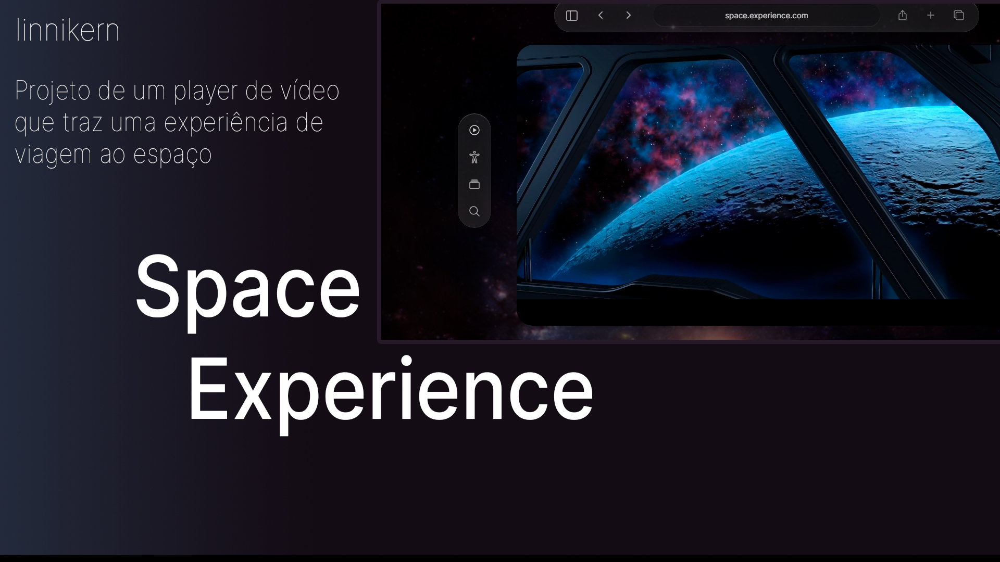

<h1 align="center"> Projeto SpaceXP 🪐 </h1>

Projeto efetuado para estudo  

  

## 🚀 Tecnologias

Esse projeto foi desenvolvido com as seguintes tecnologias:

- HTML e CSS
- JavaScript
- Git e Github
- Figma

## 💻 Projeto

O projeto é player com o objetivo de trazer um sensação de viagem ao espaço, com ambiente que remete à uma cabine de nave, trazendo uma experiência incrível

- [Acesse o projeto finalizado, online](https://linnikern.github.io/SpaceXP)

---
